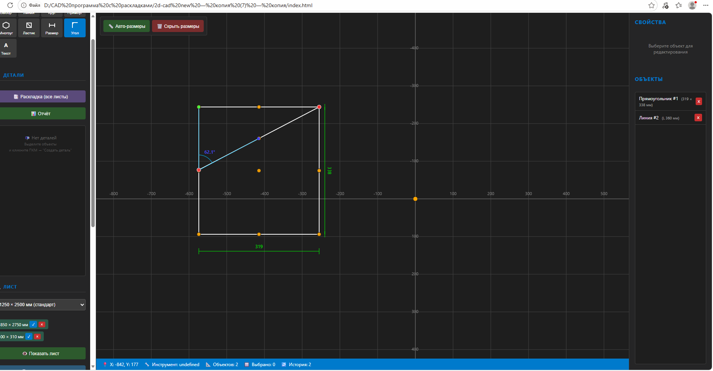
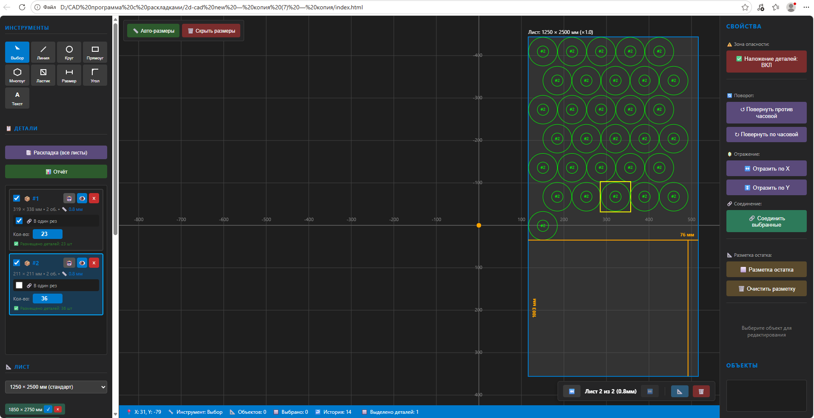
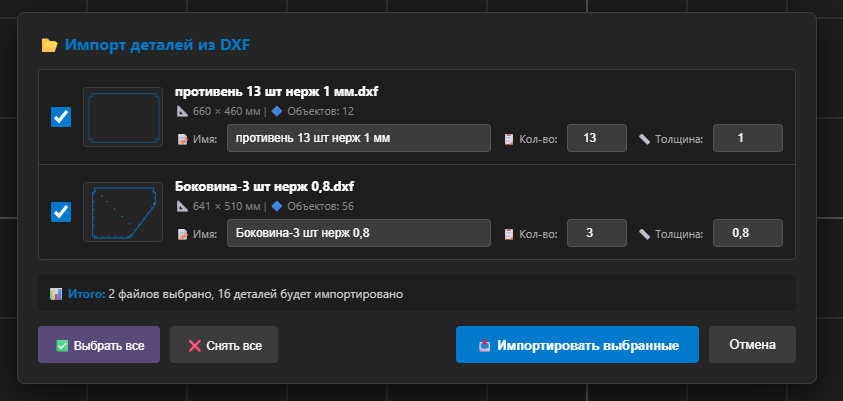
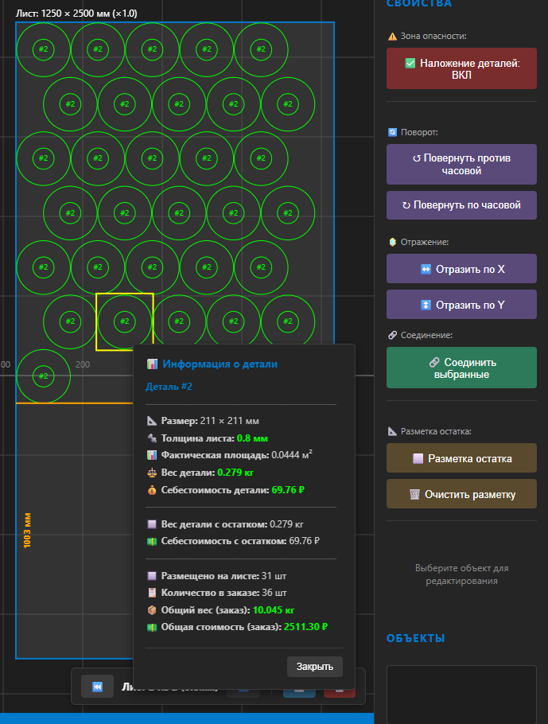
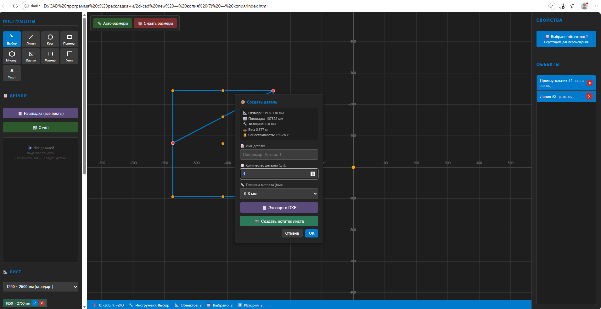
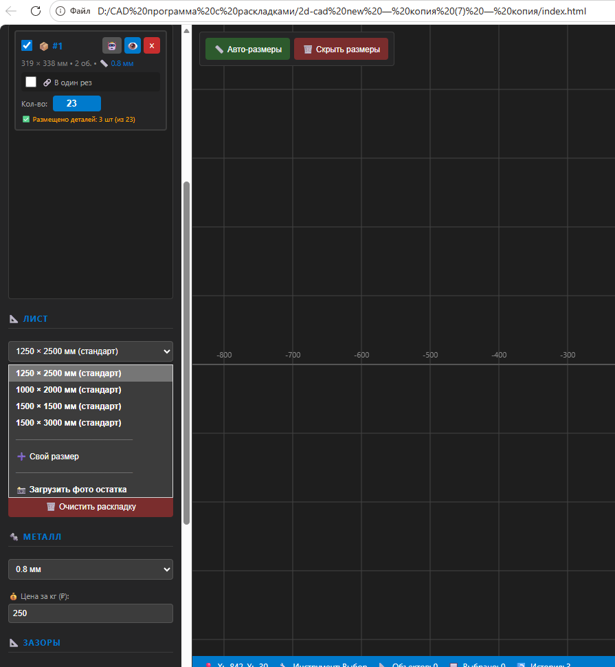
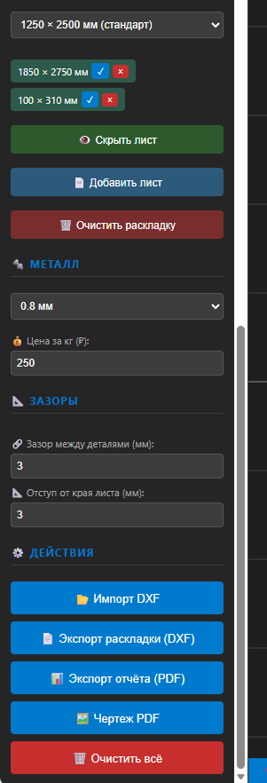

# Cutsy — Sheet Metal Nesting CAD


**Cutsy** is a 2D CAD application for creating technical drawings with automatic sheet metal nesting. Supports DXF import/export, SVG and PDF export.

**License: Non-Commercial.** You may use this software for free for personal use. Commercial use (selling, SaaS, etc.) is prohibited. See [LICENSE](LICENSE).
https://youtu.be/6bD4RjEwg08
## 🎬 Demo


---

## 📸 Screenshots

### Drawing Parts


### Sheet Nesting


### Part Import


### Nesting Report


### Part Report


### Sheet Selection


### Edit Menu


---

## 🚀 Quick Start

### Option 1: Open directly
```bash
# Double-click index.html or
start index.html  # Windows
open index.html   # macOS
xdg-open index.html  # Linux
```

### Option 2: Via local server
```bash
npm install
npm start
# Open http://localhost:8080
```

---

## ✨ Features

### 🎨 Drawing Tools
- **Line** — with length display
- **Circle** — with diameter display
- **Rectangle** — with dimensions
- **Polygon** — configurable number of sides
- **Text** — text labels

### 📐 Dimensions
- **Linear dimensions** — horizontal, vertical, inclined
- **Angular dimensions** — 2 clicks on lines or 3 points

### 📦 Nesting
- **Automatic nesting** — optimal part placement
- **Multi-sheet nesting** — automatic creation of new sheets
- **Thickness grouping** — parts of different thickness on separate sheets
- **NFP algorithm** — precise nesting geometry
- **Spatial Grid** — spatial indexing for speed
- **"One Cut" mode** — placement with shared edge (0 gap)
- **Rotation modes** — fast (2 angles), full (19 angles), auto
- **Part rotation and flipping** on sheet

### 📥 Import
- **DXF** — import drawings with automatic part creation

### 📤 Export
- **DXF** — compatible with AutoCAD, LibreCAD, QCAD
- **SVG** — vector format
- **PDF (drawing)** — A4, white background, black lines
- **PDF (report)** — nesting report with parts table

### 📸 Sheet Remnant
- **Photo remnant** — load photo with 2-point calibration
- **Remnant markup** — rectangles for placement in remnants

### 💾 Caching
- **Auto-save** — parts saved to localStorage every 3 seconds
- **Auto-restore** — parts restored on page reload

### 🌐 Multilingual
- **English** and **Russian** interface
- Language switch button EN/RU
- Language preference saved in localStorage

---

## ⌨️ Keyboard Shortcuts

| Key | Action |
|---------|----------|
| `Ctrl+click` | Multi-select |
| `Ctrl+Z` | Undo action |
| `Delete` | Delete selected object |
| `Alt+LMB` | Panning |
| `Mouse wheel` | Zoom |

---

## 📁 Project Structure

```
Cutsy/
├── index.html              # Main application
├── styles.css              # Styles
├── package.json            # Node.js configuration
├── server.js               # Simple HTTP server
│
├── nesting.js              # Nesting algorithm (NFP, Spatial Grid)
├── nesting-worker.js       # Web Worker for nesting
├── render.js               # Canvas rendering
├── shapes.js               # Shape classes (Line, Circle, Rect, Polygon)
├── snapping.js             # Point and edge snapping
├── dimensions.js           # Dimension lines
├── dxf-import.js           # DXF import
├── dxf-import-ui.js        # DXF import UI
├── svg-export.js           # SVG export
├── detail-export.js        # Detail export
├── flip-nested.js          # Part flipping on sheet
├── sheet-remnant.js        # Sheet remnant handling
├── translations.js         # i18n translations (EN/RU)
│
├── screenshots/            # Application screenshots
│
└── js/
    ├── globals.js          # Global variables
    ├── store.js            # State management
    ├── validators.js       # Data validation
    ├── sound.js            # Sound effects
    ├── join-parts.js       # Part joining
    ├── mouse-events.js     # Mouse handling
    ├── keyboard-events.js  # Keyboard handling
    └── context-menus.js    # Context menus
```

---

## 🌐 Offline Mode

The application **works completely offline**:
- All data stored locally (localStorage)
- No internet connection required after loading
- Can be used on computers without internet access

---

## 🛠️ Technologies

- **HTML5 Canvas** — rendering
- **Vanilla JavaScript** — no frameworks
- **Web Worker** — nesting in separate thread
- **localStorage** — data caching

---

**Enjoy using! 🎨**
